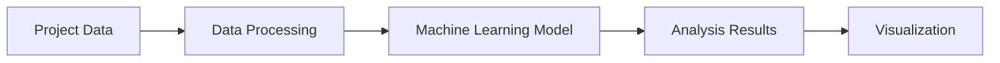

# EcoAudit Product Requirements Document
## Executive Summary
EcoAudit is a data-driven web application designed to assess and visualize the environmental impact of urban development projects. By leveraging Data Science and machine learning, EcoAudit provides a comprehensive analysis of potential environmental impacts, enabling stakeholders to make informed decisions and optimize project designs for sustainability.

## Market Analysis
The urban development sector is rapidly growing, with an increasing focus on sustainability and environmental responsibility. Current methods for environmental impact assessments are often time-consuming, costly, and fragmented, creating a significant opportunity for a comprehensive and accessible platform like EcoAudit.

### Market Size and Growth
The global urban development market is projected to reach $1.5 trillion by 2025, with a compound annual growth rate (CAGR) of 10%. The environmental consulting market, a key segment for EcoAudit, is expected to grow at a CAGR of 8% during the same period.

### Competitive Landscape
While there are existing environmental impact assessment tools, they are often limited in scope, fragmented, and not tailored to the specific needs of urban development projects. EcoAudit's comprehensive approach, leveraging Data Science and machine learning, positions it as a unique solution in the market.

### Business Justification
EcoAudit addresses a significant pain point in the urban development sector, providing a valuable service that can lead to cost savings, reduced environmental impact, and improved project outcomes. By offering a user-friendly, data-driven platform, EcoAudit can capture a significant share of the market and establish itself as a leader in the environmental consulting space.

## User Personas
### Urban Planner
* **Name:** Alexandra
* **Role:** Urban Planner
* **Responsibilities:** Designing and implementing urban development projects
* **Pain Points:** Limited resources, tight deadlines, and the need to balance competing stakeholder interests
* **Goals:** To deliver sustainable, environmentally responsible projects that meet community needs
* **Needs:** Comprehensive environmental impact assessments, data-driven insights, and stakeholder engagement tools

### Environmental Analyst
* **Name:** Ethan
* **Role:** Environmental Analyst
* **Responsibilities:** Conducting environmental impact assessments and providing recommendations
* **Pain Points:** Limited data, complex analysis requirements, and the need to communicate findings effectively to stakeholders
* **Goals:** To provide accurate, actionable environmental impact assessments that inform project decisions
* **Needs:** Advanced data analysis capabilities, robust reporting tools, and collaboration features

### Developer
* **Name:** David
* **Role:** Developer
* **Responsibilities:** Overseeing project execution and compliance with environmental regulations
* **Pain Points:** Limited visibility into environmental impact, complex regulatory requirements, and the need to balance project timelines and budgets
* **Goals:** To deliver projects that meet environmental regulations and stakeholder expectations
* **Needs:** Integration with project management tools, real-time environmental impact monitoring, and compliance reporting

## Solution Architecture
EcoAudit's architecture is designed to provide a seamless, data-driven experience for users. The platform consists of the following components:

1. **Frontend:** A user-friendly interface built using React, providing interactive visualizations and reporting capabilities.
2. **Backend (Flask):** Handles data processing, machine learning model integration, and API endpoints.
3. **Database (PostgreSQL):** Stores project data and analysis results.
4. **Machine Learning Model:** Analyzes project data to predict environmental impacts.

### System Design
The system is designed to handle the following workflows:

* **Project Input:** Users input project details, including location, size, and type.
* **Environmental Impact Assessment:** The system analyzes the project's potential environmental impacts using the machine learning model.
* **Data Visualization:** Interactive visualizations display analysis results, helping users understand the project's ecological footprint.
* **Reporting:** Users can generate and download detailed reports, facilitating stakeholder communication and decision-making.

### Data Flow


## Technical Specifications
### Backend (Flask)
* **API Endpoints:** RESTful API endpoints for project data ingestion, analysis, and reporting
* **Machine Learning Model Integration:** Integration with a trained machine learning model for environmental impact assessment
* **Database Interaction:** Interaction with the PostgreSQL database for storing and retrieving project data and analysis results

### Frontend (React)
* **User Interface:** Interactive, user-friendly interface for project input, data visualization, and reporting
* **Visualization Library:** Integration with a visualization library (e.g., Chart.js) for displaying analysis results

### Database (PostgreSQL)
* **Schema Design:** A well-designed schema to store project data and analysis results
* **Data Ingestion:** Efficient data ingestion mechanisms for handling large datasets

### Machine Learning Model
* **Model Training:** Training a machine learning model on a dataset of environmental impact assessments
* **Model Deployment:** Deploying the trained model within the EcoAudit platform

## Feature Specifications
### Core Features
1. **Project Input:** Users can input project details, including location, size, and type.
2. **Environmental Impact Assessment:** The system analyzes the project's potential environmental impacts.
3. **Data Visualization:** Interactive visualizations display analysis results.
4. **Reporting:** Users can generate and download detailed reports.

### User Stories
* As an urban planner, I want to input project details so that I can receive an environmental impact assessment.
* As an environmental analyst, I want to review detailed analysis reports so that I can identify areas for improvement.
* As a developer, I want to access the platform's API so that I can integrate environmental impact assessments into our project management tools.

## Implementation Tasks
### Phase 1: Project Setup (Day 1)
1. Set up Flask backend
2. Initialize PostgreSQL database
3. Design basic frontend structure using React

### Phase 2: Data Processing and Machine Learning (Days 2-3)
1. Develop data processing pipeline
2. Integrate machine learning model for environmental impact assessment

### Phase 3: Visualization and Reporting (Days 4-5)
1. Implement interactive data visualizations using Chart.js
2. Develop reporting feature

### Phase 4: Testing and Deployment (Days 6-7)
1. Conduct thorough testing of all features
2. Deploy application to a cloud platform (e.g., AWS, Google Cloud)

## Implementation Timeline
The project will be completed within 1 week, divided into four phases: project setup, data processing and machine learning, visualization and reporting, and testing and deployment.

### Detailed Timeline
* **Day 1:** Project setup
* **Days 2-3:** Data processing and machine learning integration
* **Days 4-5:** Visualization and reporting features
* **Days 6-7:** Testing and deployment

## Risk Assessment and Mitigation Strategies
### Risks
1. **Data Quality Issues:** Poor data quality can impact the accuracy of environmental impact assessments.
2. **Model Performance:** The machine learning model's performance may not meet expectations.
3. **Scalability:** The platform may not scale to meet the needs of a growing user base.

### Mitigation Strategies
1. **Data Quality:** Implement data validation and cleaning mechanisms to ensure high-quality data.
2. **Model Performance:** Continuously monitor and update the machine learning model to improve performance.
3. **Scalability:** Design the platform with scalability in mind, using cloud services and load balancing techniques.

## Success Metrics
1. **User Adoption:** Measure the number of users adopting the platform.
2. **Project Coverage:** Track the number of projects assessed using EcoAudit.
3. **Customer Satisfaction:** Conduct regular customer satisfaction surveys to gauge user satisfaction.

## Code Snippets
### Machine Learning Model Integration
```python
from sklearn.ensemble import RandomForestRegressor
from sklearn.model_selection import train_test_split

# Sample data
X = [...]  # Features
Y = [...]  # Target variable

X_train, X_test, Y_train, Y_test = train_test_split(X, Y, test_size=0.2, random_state=42)

model = RandomForestRegressor()
model.fit(X_train, Y_train)

# Prediction
y_pred = model.predict(X_test)
```

### Data Visualization
```javascript
// Using Chart.js
const ctx = document.getElementById('myChart').getContext('2d');
const chart = new Chart(ctx, {
    type: 'bar',
    data: {
        labels: ['Energy Consumption', 'Carbon Emissions', 'Water Usage'],
        datasets: [{
            label: 'Environmental Impact',
            data: [y_pred[0], y_pred[1], y_pred[2]],
            backgroundColor: [
                'rgba(255, 99, 132, 0.2)',
                'rgba(54, 162, 235, 0.2)',
                'rgba(255, 206, 86, 0.2)'
            ],
            borderColor: [
                'rgba(255, 99, 132, 1)',
                'rgba(54, 162, 235, 1)',
                'rgba(255, 206, 86, 1)'
            ],
            borderWidth: 1
        }]
    },
    options: {
        scales: {
            y: {
                beginAtZero: true
            }
        }
    }
});
```

## Mermaid Diagrams
### Application Architecture


### User Interaction Flow
```mermaid
graph LR;
    A[User] -->|Input Project Details|> B[Project Input Form];
    B -->|Submit|> C[Environmental Impact Assessment];
    C -->|Display Results|> D[Visualization];
    D -->|Generate Report|> E[Reporting];
```

## Additional Sections
### Data Storage and Management
EcoAudit will store project data and analysis results in a PostgreSQL database. The database schema will be designed to accommodate various project types and sizes.

### Security and Compliance
EcoAudit will implement robust security measures, including data encryption, access controls, and regular security audits, to ensure compliance with relevant regulations (e.g., GDPR, HIPAA).

### Scalability and Performance
EcoAudit will be designed to scale horizontally, using cloud services and load balancing techniques, to ensure high performance and availability.

### Future Roadmap
EcoAudit plans to expand its capabilities to include more advanced machine learning models, additional project types, and integrations with other relevant tools and platforms.
